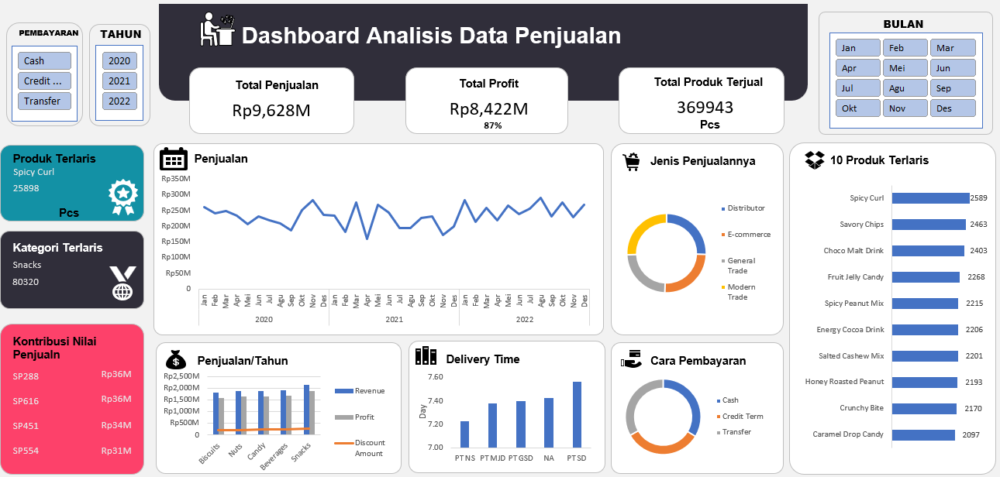

# 📊 Sales Data Analysis Dashboard (Excel + VBA)

## 📌 Overview

This project demonstrates a lightweight **end-to-end data pipeline** built using Microsoft Excel and VBA.

It automates the process of importing raw CSV files, performing data cleaning, and transforming the data into an interactive dashboard for sales analysis.

The solution simulates a real-world analytics workflow within an Excel environment.

---

## ⚙️ Key Features

### 🔄 Automated Data Ingestion (VBA)

* Batch import multiple CSV files from source folder
* Append new data into raw dataset
* Automatically archive processed files
* Prevent duplicate ingestion

### 🧹 Automated Data Cleaning (VBA)

* Incremental processing (only new data)
* Trim text fields
* Handle empty and error values
* Convert data types (date & numeric)
* Remove duplicate records

### 📊 Interactive Dashboard

* KPI metrics:

  * Total Revenue
  * Total Profit
  * Total Quantity Sold
* Sales trend analysis (monthly & yearly)
* Top products and categories
* Sales channel distribution
* Payment method breakdown
* Delivery time comparison

---

## 🧱 Tech Stack

* Microsoft Excel (.xlsm)
* VBA (Visual Basic for Applications)
* Pivot Tables
* Excel Charts & KPI Cards

---

## 🔄 Data Pipeline Architecture

```id="flow1"
[CSV Files] 
    ↓
(VBA ImportData)
    ↓
[RawData Sheet]
    ↓
(VBA CleanData)
    ↓
[CleanedData Table]
    ↓
[Pivot Tables]
    ↓
[Dashboard]
```

---

## 📂 VBA Automation

### 1. Import Data (`ImportData`)

Handles batch ingestion of CSV files:

* Reads all `.csv` files from source folder
* Appends data into `RawData`
* Moves processed files to archive folder

```vb
Sub ImportData()
    ' Batch import CSV → RawData → Archive
End Sub
```

---

### 2. Data Cleaning (`CleanData`)

Performs transformation and validation:

* Incremental update logic
* Text standardization (Trim)
* Data type conversion
* Duplicate removal

```vb
Sub CleanData()
    ' Clean & transform raw data
End Sub
```

---

## 📊 Dashboard Preview



---

## 📁 Project Structure

```
excel-sales-dashboard/
│
├── data/
│   ├── raw_data_sample.csv
│   └── cleaned_data_sample.csv
│
├── excel/
│   └── sales_dashboard.xlsm
│
├── vba/
│   ├── import_data.bas
│   └── clean_data.bas
│
├── docs/
│   ├── dashboard_preview.png
│   └── data_flow_diagram.png
│
└── README.md
```

---

## 🚀 How to Use

1. Place CSV files into:

   ```
   D:\VBA Macro Excel\Source Data\
   ```

2. Open:

   ```
   sales_dashboard.xlsm
   ```

3. Run macro:

   * `ImportData` → load new files
   * `CleanData` → process data

4. Refresh Pivot Tables

5. View updated dashboard

---

## 🧠 Business Questions Answered

* What is the total revenue and profit?
* Which products and categories generate the most sales?
* How do sales trends evolve over time?
* Which sales channels dominate performance?
* What are the most used payment methods?
* Which distributors have the fastest delivery time?

---

## ⚠️ Limitations

* File path is currently hardcoded (local environment)
* Data is synthetic (AI-generated)
* Limited data validation rules
* Not optimized for large-scale datasets

---

## 🚀 Future Improvements

* Parameterize file paths (dynamic folder selection)
* Add data validation rules (null handling, outliers)
* Integrate SQL / Python for scalable processing
* Add advanced metrics (profit margin, growth rate)
* Migrate dashboard to Power BI

---

## 👤 Author

Fadhli Hatta
